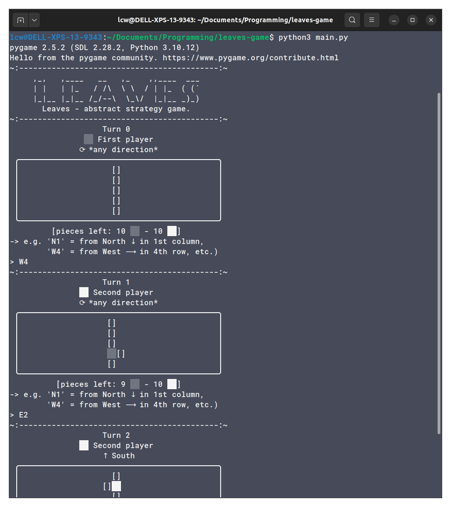
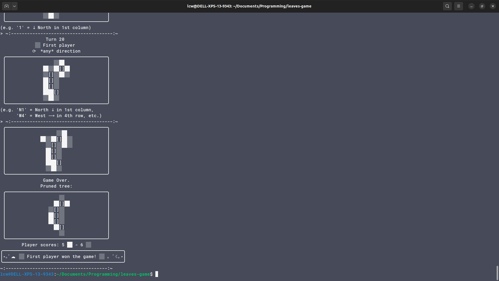
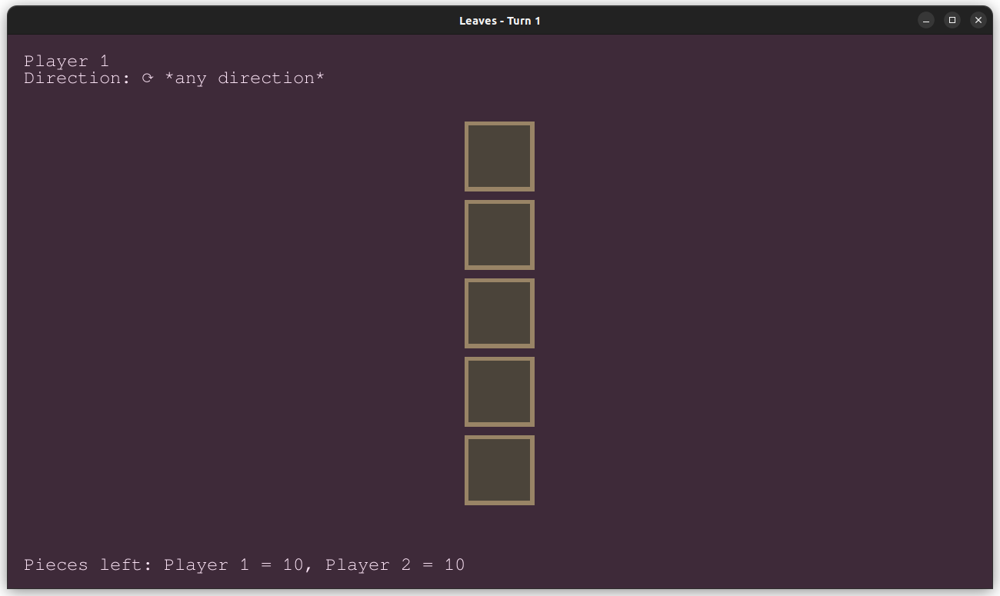
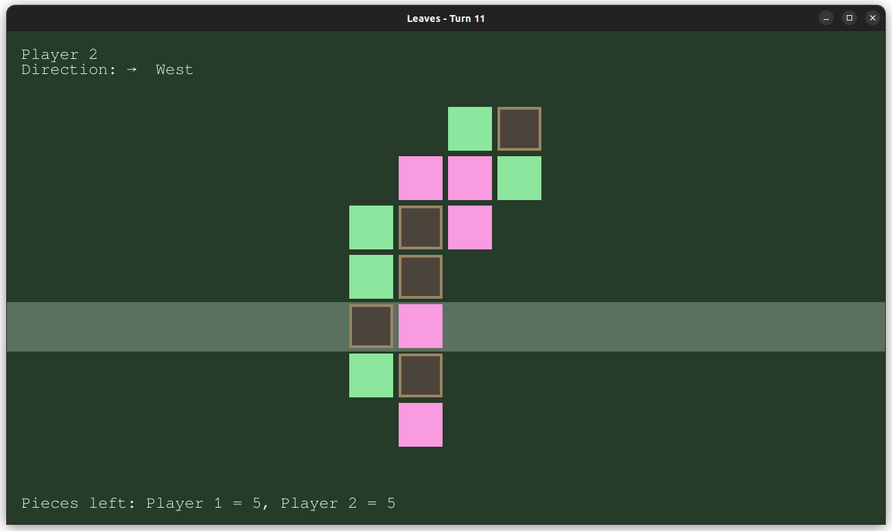
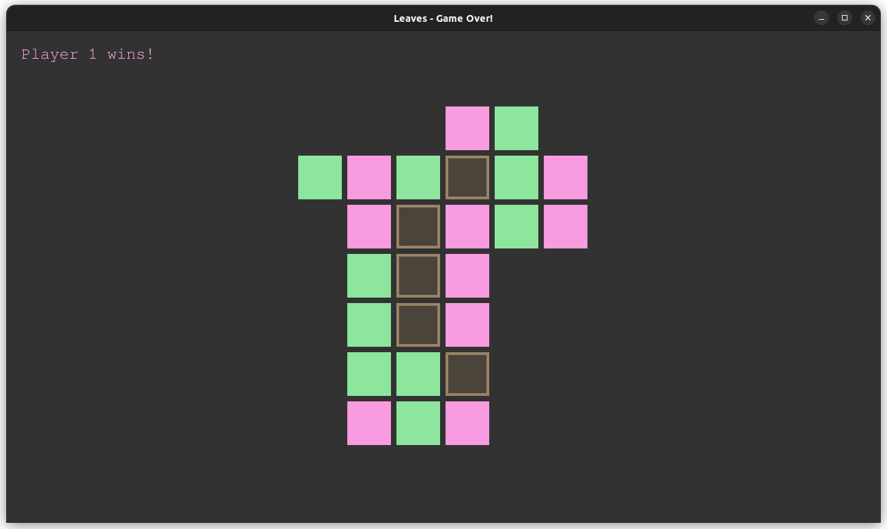

# leaves-game
*Leaves - A test implementation of the abstract strategy game.*

## What is this?

A 'quick and dirty' hobby recreation of IsawU's [original abstract strategy game](#resources) *'Leaves'* in Python, for the command line (ASCII art) and with pygame.

## How to use it

Run `main.py` to try out the game on the command line and in a `pygame` widget.
- The console interface uses simple text inputs (see also the provided [example inputs file](./leaves_example_input.txt) for a demo game).
- The GUI operates with mouse (clicking) on the sides of the board from where a leaf should be placed (the respective line will light up). The game can be reset with `Ctrl + r` and quit with `Ctrl + c`. A pruned version of the board can be toggled with `Ctrl + p`).

## What can it do?

The [main script](./leaves.py) implements a `Game` class that contains the main logic of making legal moves and handling game state.
Upon this I built two interfaces for the game:
- `leaves_console.run` takes a game instance and allows it to be played on the command line.
- `leaves_pygame.run` takes an instance and allows it to be played in a GUI with the mouse.

## Gallery

Screenshots from the game.

### Command line (ASCII art)

### Pygame (GUI)

## Resources
- [YouTube video "Original abstract strategy game: Leaves"](https://www.youtube.com/watch?v=RQx2V76qQfg)
- [Full rules + 3D-print models](https://www.printables.com/model/72515-abstract-strategy-game-leaves)
