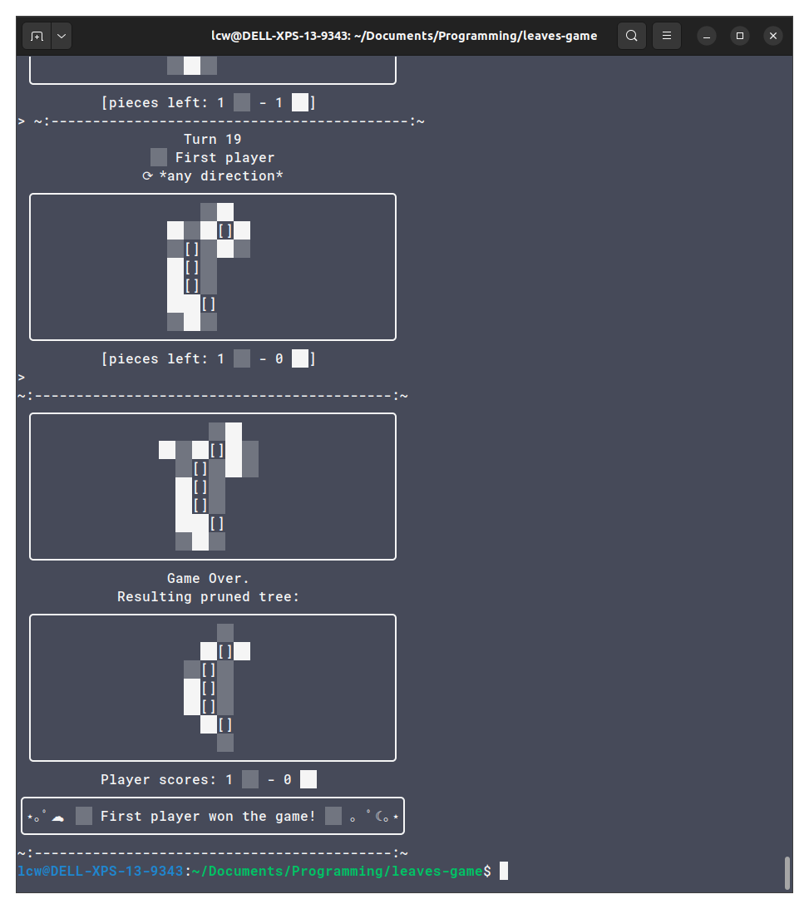

# leaves-game
*Leaves - A test implementation of the abstract strategy game.*

## What is this?

A quick hobby recreation of IsawU's original abstract strategy game *Leaves* in Python.

## How to use it

Run `leaves.py` to try out the game in console and as `pygame` widget.
- The console interface uses simple text inputs, see also the provided example inputs file for an example game.
- The GUI operates with mouse (clicking) on the side where a leaf should be placed (the respective line will light up). It can be reset with `ctrl + R` and quit with `ctrl + C`.

## What can it do?

The main script implements a `LeavesGame` class that contains the main logic of making legal moves and handling game state.
Upon this I built two interfaces for the game:
- `run_console` takes a game instance and allows it to be played on the command line. 
- `run_pygame` takes an instance and allows it to be played in a GUI with the mouse.

## Gallery

### Console

### Pygame GUI

## Resources
- [YouTube video "Original abstract strategy game: Leaves"](https://www.youtube.com/watch?v=RQx2V76qQfg)
- [Full rules + 3D-print models](https://www.printables.com/model/72515-abstract-strategy-game-leaves)
